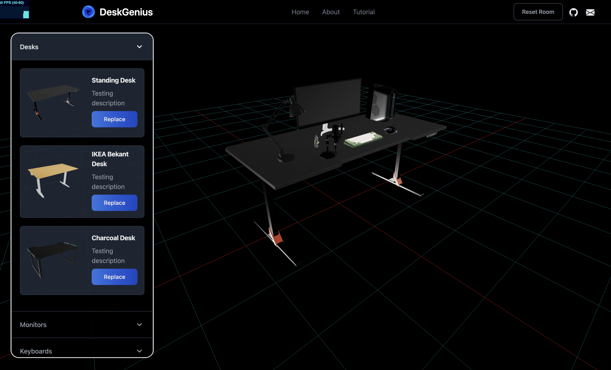

#  DeskGenius [@deskgenius.vercel.app](https://deskgenius.vercel.app/).

  <kbd>
    
  </kbd>

by Aditya

DeskGenius is a web application that utilizes 3D rendering technology to help you visualize table arrangements before making a purchase. Whether you're setting up a home office, workspace, or gaming station, DeskGenius allows you to explore different desk configurations in a virtual environment. By combining the power of Next.js and Three Fiber (Three.js), DeskGenius offers an interactive and immersive experience that saves you time, money, and energy in creating your dream setup.

## Key Features

-   **3D Rendering**: DeskGenius leverages the capabilities of Three Fiber (Three.js) to create realistic 3D models of various desk components, allowing you to visualize your desired table arrangements from different angles.
    
-   **Real-Time Preview**: Instantly see the changes you make to your desk arrangement, providing immediate feedback and facilitating quick decision-making.
    
-   **Multiple Models at Disposal**: DeskGenius offers a wide selection of desk models to choose from, with new additions constantly being incorporated to provide you with endless possibilities for your ideal setup.

## Technologies Used

-   **Next.js**: DeskGenius is built on Next.js, a React framework that provides server-side rendering, easy routing, and optimized performance.
    
-   **Three Fiber (Three.js)**: Three Fiber is a React renderer for Three.js, allowing the creation of interactive and visually stunning 3D scenes in a web environment.

- **drei (Three.js Library)** : drei is a collection of useful helpers and fully functional abstractions for [@react-three/fiber](https://github.com/pmndrs/react-three-fiber).

-  **TailwindCSS**: DeskGenius utilizes Tailwind CSS for stylish and responsive design, providing an intuitive and visually appealing experience as you create your perfect desk setup.

## Future of this project

Building this project has been an incredibly rewarding experience, allowing me to delve into the fascinating realm of web-based 3D rendering. Throughout the development process, I discovered the immense potential of this technology in transforming the way we visualize and design our spaces. Moving forward, I am excited to introduce new features such as customizable length and width table configurations, empowering users to personalize their setups even further. Additionally, I am might work on implementing configuration saving functionality to enable users to conveniently store and revisit their favorite arrangements. My ultimate goal is to enhance the versatility of DeskGenius by enabling direct model imports, expanding the range of options and possibilities for creating your dream desk setup. Stay tuned for these exciting updates!

## Install Locally

To get a local copy of DeskGenius up and running, follow these steps:

1.  Clone this repository: `https://github.com/thisisadityapatel/deskgenius.git`
2.  Navigate to the project directory: `cd deskgenius`
3.  Install the dependencies: `yarn install`
4.  Start the development server: `yarn dev`
5.  Open your web browser and visit: `http://localhost:3000`

## License

This project is licensed under the [MIT License](https://github.com/thisisadityapatel/deskgenius/blob/main/LICENSE).

## Acknowledgements

-   [Next.js](https://nextjs.org/)
-   [Three Fiber](https://github.com/pmndrs/react-three-fiber)
-   [Three.js](https://threejs.org/docs/index.html#manual/en/introduction/Creating-a-scene)
-   [Vercel](https://vercel.com/)
-   [Unsplash](https://unsplash.com/) for the images used in the application.

----------

With DeskGenius, designing your perfect desk setup has never been easier. Save time, money, and energy by visualizing and experimenting with different configurations before making a purchase. Lets DeskGenius!!
